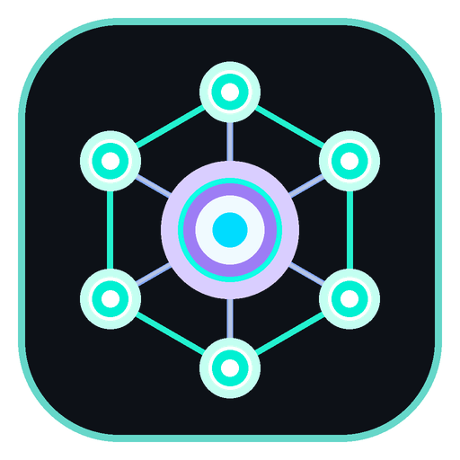

<div align="center">



# 🌐 Community AI (v1.0)

**Decentralized, Heterogeneous, Zero-Knowledge AI Computing Mesh**

[](https://www.rust-lang.org/)
[](https://www.typescriptlang.org/)
[](LICENSE)
[](#-cross-platform-installation-guides-non-technical)
[](#-how-the-p2p-mesh-works)

*Turn everyday consumer devices—smartphones, laptops, gaming PCs, and workstations—into a united, privacy-preserving distributed supercomputer for Large Language Model inference.*

---

</div>

## 📌 Table of Contents

- [🚀 Quick Download Links](#-quick-download-links-ready-to-use)
- [📱 Cross-Platform Installation Guides (Non-Technical)](#-cross-platform-installation-guides-non-technical)
  - [Android (Phones & Tablets)](#-android-installation)
  - [Linux / Ubuntu Desktop](#-linux--ubuntu-desktop-installation)
  - [Windows](#-windows-installation)
  - [macOS](#-macos-installation)
  - [Web Browser / iOS (PWA)](#-web-browser--ios-pwa-installation)
- [✨ Everything About the App](#-everything-about-the-app)
  - [1. Intelligent AI Chat](#1-intelligent-ai-chat)
  - [2. Privacy-First Cluster Network](#2-privacy-first-cluster-network)
  - [3. Real-Time Device Telemetry](#3-real-time-device-telemetry)
  - [4. Background Worker Controls & Resource Governor](#4-background-worker-controls--resource-governor)
- [🔒 Zero-Knowledge Privacy & Security](#-zero-knowledge-privacy--security)
- [🏛 Technical Architecture & Crate Workspace](#-technical-architecture--crate-workspace)
- [🛠 Developer & Build Guide](#-developer--build-guide)
- [📜 Model Licensing & Policy](#-model-licensing--policy)
- [📄 License](#-license)

---

## 📦 Quick Download Links (Ready to Use)

All pre-compiled packages and installation scripts are available directly in this repository in the [`dist/`](dist/) folder:

| Operating System | Package / Artifact | Direct Link | Installation Type |
| :--- | :--- | :--- | :--- |
| **Android** | `CommunityAI.apk` | [⬇️ Download Android APK](dist/CommunityAI.apk) | 1-Tap Mobile App Installer |
| **Ubuntu / Linux** | `install-desktop.sh` | [⬇️ Run Desktop Installer](dist/install-desktop.sh) | 1-Click Desktop & Menu Shortcut |
| **Ubuntu / Linux** | `launch-app.sh` | [⬇️ Run Direct Launcher](dist/launch-app.sh) | Standalone Native App Window |
| **All Platforms (WAN)** | `start-wan-mesh.sh` | [⬇️ Start WAN Mesh Relay](dist/start-wan-mesh.sh) | Global Internet Mesh Relay |
| **Web / Browser** | Web PWA Build | [🌐 Launch Web App](community-ai/packages/web/) | Zero-Install Instant WebGPU |

---

## 📱 Cross-Platform Installation Guides (Non-Technical)

### 🤖 Android Installation

You can install Community AI directly on any Android phone or tablet (Android 8.0+):

#### Option A: Direct Download & Install on Phone (Easiest)
1. Download [`dist/CommunityAI.apk`](dist/CommunityAI.apk) directly to your Android device (via browser or file transfer).
2. Tap the downloaded `.apk` file in your notifications or Downloads folder.
3. If prompted by Android, tap **"Settings"** and toggle **"Allow from this source"** to enable app installation.
4. Tap **"Install"**, then tap **"Open"**.
5. The Community AI app will launch with full access to the decentralized AI mesh!

#### Option B: 1-Click Install via USB (from Computer)
1. Connect your Android phone to your computer via USB with **USB Debugging** enabled in Developer Options.
2. Open terminal in the project folder and run:
   ```bash
   ./dist/install-to-android.sh
   ```
3. The script will automatically detect your phone, install the latest APK, and launch the app.

---

### 🐧 Linux / Ubuntu Desktop Installation

For Ubuntu, Debian, Fedora, Arch, and other Linux distributions:

#### Option A: 1-Click Desktop App Integration (Recommended)
1. Run the desktop installer script:
   ```bash
   ./dist/install-desktop.sh
   ```
2. **Done!** The app is now permanently registered into your system:
   - Search **"Community AI"** in your Ubuntu Application Menu / Dash.
   - Or double-click the **"Community AI"** shortcut on your Desktop.

#### Option B: Direct Launcher
Launch the standalone application window immediately:
```bash
./dist/launch-app.sh
```

#### Option C: Persistent 24/7 Background Service (Headless or Always-On)
To contribute idle computing power silently in the background via systemd:
```bash
sudo ./platform/linux/install.sh
```
- **Check Status**: `sudo systemctl status community-ai`
- **View Live Logs**: `sudo journalctl -u community-ai -f`

---

### 🪟 Windows Installation

1. **Web / PWA Standalone Mode**:
   - Start or open the web dashboard in Google Chrome or Microsoft Edge (`http://localhost:5173` or your mesh IP).
   - Click the **"Install App"** icon in the address bar (or menu $\rightarrow$ *Apps* $\rightarrow$ *Install Community AI*).
   - Community AI will now run in its own dedicated, borderless window with desktop shortcuts.
2. **Persistent Background Service**:
   - Register the native daemon using Windows Service Controller with `platform/windows/service_config.json`.

---

### 🍎 macOS Installation

1. **Web / PWA Standalone Mode**:
   - Open the web interface in Safari or Google Chrome.
   - In Safari: Click **File** $\rightarrow$ **Add to Dock**.
2. **Background Daemon (Apple Silicon & Intel)**:
   - Copy the launchd plist descriptor:
     ```bash
     cp platform/macos/com.community.ai.daemon.plist ~/Library/LaunchAgents/
     launchctl load ~/Library/LaunchAgents/com.community.ai.daemon.plist
     ```

---

### 🌐 Web Browser / iOS (PWA) Installation

Community AI runs directly inside modern web browsers with WebGPU support:
1. Open the web client on your iPhone, iPad, or Chromebook.
2. On iOS (Safari): Tap the **Share** button $\rightarrow$ Tap **"Add to Home Screen"**.
3. Launch Community AI from your home screen just like a native app.

---

## ✨ Everything About the App

Community AI brings consumer-grade distributed intelligence to your fingertips through four unified tabs:

```
┌─────────────────────────────────────────────────────────────────────────────┐
│  🌐 Community AI       [● P2P Mesh: 4 Nodes Online]   [⚡ Contributing: ON] │
├───────────────┬───────────────────┬───────────────────┬─────────────────────┤
│  💬 AI Chat   │ 📊 Device Monitor │ ⚙️ Worker Control │ 🌐 Cluster Network  │
└───────────────┴───────────────────┴───────────────────┴─────────────────────┘
```

### 1. 💬 Intelligent AI Chat
- **Real-Time Token Streaming**: Prompt the decentralized AI cluster and receive high-speed streaming responses.
- **Staged Visual Progress**: Clear real-time status steps:
  - 🔍 *Searching for capable peers in mesh...*
  - ⚡ *Partitioning layers & allocating pooled VRAM across devices...*
  - 🤖 *Generating tokens across cluster...*
- **Visual Pipeline Inspector**: View how transformer layers are partitioned across participating devices in real time.

### 2. 🌐 Privacy-First Cluster Network
- **Zero Exposure of Personal Data**: Individual user information and device identities are never exposed to other peers.
- **Aggregated Network Intelligence**:
  - **Connected Mesh Peers**: Total nodes active in the swarm.
  - **Active Contributors**: Nodes currently contributing compute resources.
  - **Pooled VRAM / RAM Capacity**: Total combined memory available for model loading.
  - **Cluster Tokens Streamed**: Total network throughput and jobs completed.
- **Your Personal Token Account**:
  - Live track of your **Available Balance**, **Tokens Earned** by contributing, and **Tokens Consumed** by prompts.
  - Ready for decentralized ledger synchronization.
- **Anonymized Activity Stream**: Real-time ticker of network jobs without displaying user identities.

### 3. 📊 Real-Time Device Telemetry
- **Hardware Dashboard**: Live monitoring of CPU cores, system RAM, GPU acceleration, and VRAM utilization.
- **UEPS Metric (User Experience Preservation Score)**: Continuous 0–100% score calculating local device responsiveness.
- **Thermal & Battery States**: Automatically detects AC power vs. battery mode to prevent battery drain on laptops and phones.

### 4. ⚙️ Background Worker Controls & Resource Governor
- **Master Contribution Switch**: Toggle background compute sharing on or off with a single click.
- **Memory & Quota Sliders**: Set exact caps on how much RAM or VRAM the app is allowed to allocate (e.g., 2 GB, 4 GB).
- **Intelligent Resource Governor**:
  - Automatically pauses compute if you start playing a video game or open a heavy application.
  - Immediately yields resources when moving on battery power.

---

## 🔒 Zero-Knowledge Privacy & Security

Community AI is built from the ground up on zero-trust principles:
1. **Cryptographic Node Identities**: Every device generates its own Ed25519 public/private keypair. Wire payloads and task completions are digitally signed.
2. **BLAKE3 Layer Verification**: Model weights and transformer shards are validated using BLAKE3 cryptographic checksums before execution.
3. **Anonymized Peer IDs**: In all chat visualizers and telemetry panels, peer node identities are masked (`Anonymous Peer #1`, `Head Cluster Peer`) so no user's private data is ever visible to others.
4. **No Centralized Data Logging**: Chat prompts and activations are passed directly peer-to-peer over encrypted WebRTC DataChannels and local loops.

---

## 🏛 Technical Architecture & Crate Workspace

```
crates/
├── community-core          # Strong identifiers (NodeId, JobId, TaskId) & domain primitives
├── community-security      # Ed25519 digital signatures, keypairs & BLAKE3 checksums
├── community-protocol      # Serde wire schemas (CapabilityProfile, PipelinePlan, TaskSpec)
├── community-governor      # Sub-second hardware monitors & User Experience Preservation (UEPS)
├── community-model-manager # Discrete layer sharder, LRU disk cache & placement scoring
├── community-runtime       # Abstract AIBackend trait for hardware-agnostic tensor execution
├── community-scheduler     # Workload analyzer, minimal-latency pipeline planner & failover
├── community-network       # Thread-safe P2P swarm, mDNS/DHT discovery & network loops
├── community-daemon        # Native background worker daemon CLI for Windows / Linux / macOS
├── community-simulator     # Discrete event cluster simulator (tested with 10–1000 nodes)
└── community-ffi           # C-FFI export library (cdylib/staticlib) for Android & iOS
```

---

## 🛠 Developer & Build Guide

### Prerequisites
- **Rust 1.80+** (`curl --proto '=https' --tlsv1.2 -sSf https://sh.rustup.rs | sh`)
- **Node.js 20+** and `npm`
- **Android SDK & NDK** (only if compiling Android native binaries)

### 1. Build and Test Rust Core
```bash
# Clone the repository
git clone https://github.com/M-Ali-Nasir/community_ai.git
cd community_ai

# Run all unit, integration, and P2P mesh tests across all 11 crates
cargo test --workspace
```

### 2. Run the Web Dashboard & P2P Coordinator
```bash
cd community-ai
npm install

# Start development server
npm run dev
```

### 3. Rebuild the Android APK
```bash
# Compile web assets
npm --prefix community-ai/packages/web run build

# Copy assets to Android project
mkdir -p platform/android/app/src/main/assets/www
cp -r community-ai/packages/web/dist/* platform/android/app/src/main/assets/www/

# Build APK using Gradle
cd platform/android
./gradlew assembleDebug
cp app/build/outputs/apk/debug/app-debug.apk ../../dist/CommunityAI.apk
```

---

## 📜 Model Licensing & Policy

This project strictly adheres to **Apache-2.0 and MIT** open-source licensing:
- **Flagship Default**: `Qwen/Qwen2.5-7B-Instruct` (Apache-2.0)
- **Lightweight / Mobile Models**: `SmolLM2-360M-Instruct` (Apache-2.0), `Qwen2.5-0.5B-Instruct` (Apache-2.0)
- **Zero-Gated Architecture**: No models with restrictive commercial agreements or mandatory account sign-ins are required.

---

## 📄 License

Distributed under the **Apache-2.0 License**. See [LICENSE](LICENSE) for full details.
