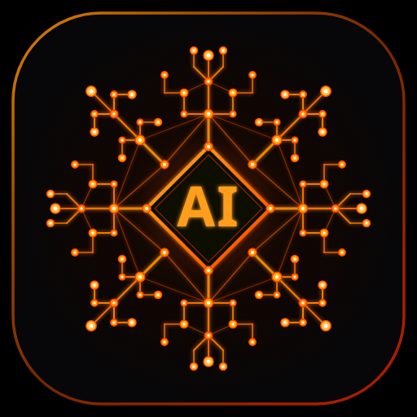

<div align="center">



# Community AI

**Version 1.0.0**

**Decentralized peer-to-peer AI desktop/mobile application**

Equal peers. Direct QUIC. Local durable storage. No central coordination server.

[](https://www.rust-lang.org/)
[](LICENSE)
[](https://github.com/M-Ali-Nasir/community_ai/releases/tag/v1.0.0)

</div>

> **Evidence classes:** **VERIFIED** means this release produced evidence for that exact claim. **NOT TESTED** means no evidence. **NOT IMPLEMENTED** means the feature is not in v1.0.0. Do not treat BUILD success as INSTALL or RUNTIME success. Authoritative packaging notes: [docs/release-builds.md](docs/release-builds.md) · status: [docs/PROJECT_STATUS.md](docs/PROJECT_STATUS.md).

Binaries are **not** stored in git (`release/` is gitignored). Installers are GitHub Release assets on tag `v1.0.0`.

---

## Table of contents

- [Download Community AI v1.0.0](#download-community-ai-v100)
- [Platform verification](#platform-verification)
- [Installation](#installation)
- [Release checksums](#release-checksums)
- [UI status](#ui-status)
- [Architecture](#architecture)
- [v1.0.0 release details](#v100-release-details)
- [v1.0.0 release notes](#v100-release-notes)
- [Security / trust model](#security--trust-model)
- [Developer / release builds](#developer--release-builds)
- [Crate workspace](#crate-workspace)
- [Model licensing](#model-licensing)
- [License](#license)

---

## Download Community AI v1.0.0

### GitHub Release

[Community AI v1.0.0 Release](https://github.com/M-Ali-Nasir/community_ai/releases/tag/v1.0.0)

| Platform | Download | Verification |
| --- | --- | --- |
| Linux x86_64 | [Download AppImage](https://github.com/M-Ali-Nasir/community_ai/releases/download/v1.0.0/Community_AI-x86_64.AppImage) | Build / Install / Runtime verified |
| Windows x86_64 | [Download Windows Installer](https://github.com/M-Ali-Nasir/community_ai/releases/download/v1.0.0/Community.AI_1.0.0_x64-setup.exe) | Build verified; install/runtime not tested |
| Android ARM64 | [Download TEST APK](https://github.com/M-Ali-Nasir/community_ai/releases/download/v1.0.0/Community-AI-1.0.0-Android-arm64-TEST.apk) | Build verified; install/runtime not tested |

GitHub stores the Windows installer as `Community.AI_1.0.0_x64-setup.exe` (space replaced with `.`). SHA256 matches the original NSIS file `Community AI_1.0.0_x64-setup.exe`.

All three packages use the same Tauri frontend (`apps/desktop/frontend/`). There is no separate Linux, Windows, or Android UI.

### Linux x86_64 — AppImage

- Asset: `Community_AI-x86_64.AppImage`
- Build: **VERIFIED** · Install: **VERIFIED** · Runtime: **VERIFIED**
- SHA256: `d1a219f3a779012cd8e5ee87543cf3c9dc9549a755510ec13ff3a4ceae7f0a99`

### Windows x86_64 — NSIS installer

- Asset (GitHub): `Community.AI_1.0.0_x64-setup.exe` (original filename `Community AI_1.0.0_x64-setup.exe`)
- Build: **VERIFIED** · Install: **NOT TESTED** · Runtime: **NOT TESTED**
- SHA256: `844be9921222c7d8a057ad9c5d5db546a81eb127b73d56611f4c3bd1643267b9`
- Packaging was a Linux cross-compile. There was no Windows host, so installation and runtime were **not** verified. Authenticode signing was **not** performed.

### Android ARM64 — TEST APK

- Asset: `Community-AI-1.0.0-Android-arm64-TEST.apk`
- Build: **VERIFIED** · Install: **NOT TESTED** · Runtime: **NOT TESTED** · Signing: **TEST**
- SHA256: `ad51a127cfe74dedc9792db76cd3c580bae83c493d5e2de2e1bff6442afc90a6`
- This is a **TEST / debug-signed** APK. It is **not** production-signed.
- `adb devices` was empty during verification, so Android install and runtime were **not** verified.
- The APK contains ARM64 native output (`lib/arm64-v8a/libcommunity_desktop_lib.so` only).
- Desktop-oriented local `llama-server` spawning is **not** claimed to work on Android. No fake inference was added to compensate.

macOS and iOS are **not** part of the v1.0.0 installable packages (**NOT TESTED**). Files under [`dist/`](dist/) (older APK/scripts) are **not** the v1.0.0 native packages.

---

## Platform verification

| Platform | Architecture | Build    | Install    | Runtime    | Signing                    |
| -------- | ------------ | -------- | ---------- | ---------- | -------------------------- |
| Linux    | x86_64       | VERIFIED | VERIFIED   | VERIFIED   | N/A                        |
| Windows  | x86_64       | VERIFIED | NOT TESTED | NOT TESTED | Authenticode not performed |
| Android  | ARM64        | VERIFIED | NOT TESTED | NOT TESTED | TEST                       |

---

## Installation

### Linux

```bash
chmod +x Community_AI-x86_64.AppImage
./Community_AI-x86_64.AppImage
```

For this release: Build **VERIFIED**, Install **VERIFIED**, Runtime **VERIFIED**.

Observed on the packaging host (not extra configuration knobs):

- The AppImage was copied out of the build tree to `/tmp` and launched from there.
- Process `community-desktop` remained running.
- WebKitGTK was mapped.
- SQLite storage was created under `~/.local/share/community-ai/storage`.
- Peer identity remained under `~/.config/community-ai/identity.key` (existing key reused; not regenerated on launch).

If the AppImage cannot FUSE-mount, `APPIMAGE_EXTRACT_AND_RUN=1` is a known workaround (see [docs/release-builds.md](docs/release-builds.md)).

### Windows

1. Download [`Community.AI_1.0.0_x64-setup.exe`](https://github.com/M-Ali-Nasir/community_ai/releases/download/v1.0.0/Community.AI_1.0.0_x64-setup.exe) from the GitHub Release (same bytes as `Community AI_1.0.0_x64-setup.exe`).
2. Run the NSIS installer.
3. Follow the installer instructions.
4. Launch Community AI.

**Windows installation and runtime were NOT TESTED for v1.0.0.**

The installer is a real NSIS/Nullsoft PE. It wraps the x86_64 PE32+ `community-desktop.exe`. Authenticode signing was not performed because packaging ran on Linux. Do not treat the Windows build as runtime-verified.

### Android

**TEST BUILD — NOT PRODUCTION SIGNED**

1. Download the ARM64 TEST APK.
2. Transfer it to an ARM64 Android device.
3. Allow installation from that source if Android requires it.
4. Install the APK.

**Android installation and runtime were NOT TESTED for v1.0.0.**

Do not claim local model inference works on Android. The mesh/UI are packaged; desktop `llama-server` spawn is not a verified Android capability.

---

## Release checksums

| Platform       | Artifact                                    | SHA256                                                             |
| -------------- | ------------------------------------------- | ------------------------------------------------------------------ |
| Linux x86_64   | `Community_AI-x86_64.AppImage`              | `d1a219f3a779012cd8e5ee87543cf3c9dc9549a755510ec13ff3a4ceae7f0a99` |
| Windows x86_64 | `Community AI_1.0.0_x64-setup.exe`          | `844be9921222c7d8a057ad9c5d5db546a81eb127b73d56611f4c3bd1643267b9` |
| Android ARM64  | `Community-AI-1.0.0-Android-arm64-TEST.apk` | `ad51a127cfe74dedc9792db76cd3c580bae83c493d5e2de2e1bff6442afc90a6` |

Linux / macOS:

```bash
sha256sum Community_AI-x86_64.AppImage
```

Windows PowerShell:

```powershell
Get-FileHash ".\Community AI_1.0.0_x64-setup.exe" -Algorithm SHA256
```

The hash must match the table exactly. Recalculate only against the same file that was released; do not assume a rebuilt binary has the same digest.

---

## UI status

The **universal responsive UI** is preserved: one frontend (`apps/desktop/frontend/`) packaged through Tauri for all three platforms.

| Form factor | Status |
| ----------- | ------ |
| Desktop | Source preserved. Linux window launch **VERIFIED**. Native interactive clicks through Chat / Peers / Models / Tasks / Network / Settings were **not** fully performed (Wayland screenshot portal returned `AccessDenied`). |
| Tablet | Source preserved. Physical tablet **NOT TESTED**. |
| Mobile | Source preserved. Android viewport/device **NOT TESTED**. |

Responsive **source / CSS viewport** checks (not device testing) included approximately: 390×844, 360×800, 768×1024, 1024×680, 1280×800, 1440×900, 1920×1080, and ~844×390 landscape.

Do not say the Android UI has been verified.

---

## Architecture

v1.0.0 production path:

```text
Tauri UI → CommunityApp → MeshSwarm → QUIC → peer → real model runtime → QUIC → originator → Tauri UI
```

Peers are equal. A peer coordinates only a task it originated. There is no central server, central database, master node, or permanent coordinator.

| Component               | Status          |
| ----------------------- | --------------- |
| Central server          | NOT IMPLEMENTED |
| Central database        | NOT IMPLEMENTED |
| Master node             | NOT IMPLEMENTED |
| Permanent coordinator   | NOT IMPLEMENTED |
| Direct QUIC             | PRESERVED       |
| Real model execution    | PRESERVED       |
| Local durable storage   | PRESERVED       |
| Compute receipts        | NOT IMPLEMENTED |
| Wallet / credits        | NOT IMPLEMENTED |
| P2P storage replication | NOT IMPLEMENTED |
| Distributed training    | NOT IMPLEMENTED |

Native UI surfaces Chat, Peers, Models, Tasks, Network, and Settings over Tauri IPC into `community-app`. Chat uses real mesh inference when a READY worker exists; it does not invent assistant tokens. **PHYSICAL WAN VERIFIED — NOT TESTED.**

---

## v1.0.0 release details

```text
Version: 1.0.0

Packaging branch:
community-ai-app-bundles

Source branch:
community_ai_v1

Source commit:
2e2caa3d33e9292b1db48be7ae0454904b1db9ef

Packaging commit:
df61ab2f3d10bfa7a30daa435347810fdfbe835f
```

Identifier: `ai.community.desktop` · product name: Community AI

Tests:

```text
cargo fmt: PASS
cargo test --workspace: PASS
Frontend validation: NOT AVAILABLE
```

---

## v1.0.0 release notes

- Cross-platform packaging added (Linux AppImage, Windows NSIS `.exe`, Android ARM64 TEST APK).
- Linux AppImage produced; install and runtime launch **VERIFIED**.
- Windows x86_64 installer produced; Windows install/runtime **NOT TESTED**.
- Android ARM64 test APK produced; Android install/runtime **NOT TESTED**.
- Universal responsive UI preserved.
- Existing decentralized architecture preserved.
- No central server, central database, or master node introduced.
- Compute receipts, wallet/credits, P2P storage replication, and distributed training remain **future work** (**NOT IMPLEMENTED**).

---

## Security / trust model

Implemented and used by the native app (not a guarantee of anonymity, perfect privacy, or proof of correct model computation):

- Ed25519 peer identity (`NodeIdentity`, local identity file)
- Signed append-only events
- Local durable storage (SQLite + content-addressed objects)
- Private local data encryption where implemented in `community-storage`
- Direct QUIC peer communication (opaque relay is optional, not a central app server)

Not claimed for v1.0.0: anonymous networking, production-grade Windows Authenticode or Android Play signing, cryptographic proof of correct inference, or PHYSICAL WAN verification.

---

## Developer / release builds

Release packages are the existing Tauri app (`apps/desktop/`), not a second frontend. Low-level commands, toolchain versions, and packaging workarounds: **[docs/release-builds.md](docs/release-builds.md)**.

```bash
git clone https://github.com/M-Ali-Nasir/community_ai.git
cd community_ai
cargo test --workspace
cd apps/desktop
npm install
npx tauri build --bundles appimage   # Linux
```

Build-environment notes (packaging host, **not** end-user install requirements):

- Distro `-dev` packages (pkg-config / WebKitGTK headers) were missing; the Linux binary was linked against a user-space sysroot.
- AppImage packing used linuxdeploy without the GTK plugin.
- Cross Windows NSIS required `clang-cl` / `lld-link` and `NSISDIR` for `makensis` (Debian `PREFIX_DATA` is `/usr/share/nsis`).

Workspace tests do not compile `apps/desktop/src-tauri` (it is excluded so GTK is not required for `cargo test --workspace`).

---

## Crate workspace

```
crates/
├── community-core
├── community-security      # Ed25519 identities, BLAKE3
├── community-protocol
├── community-governor
├── community-model-manager
├── community-runtime       # llama.cpp via llama-server on desktop when a GGUF is configured
├── community-scheduler
├── community-network       # MeshSwarm, QUIC
├── community-storage       # peer-local SQLite + objects
├── community-app           # native session API used by Tauri
├── community-daemon
├── community-simulator
└── community-ffi
```

---

## Model licensing

This project uses Apache-2.0 / MIT-compatible model choices where models are configured. No cloud account is required to run the peer. Default local model id in the desktop session is a configured GGUF path when present; empty model state is shown honestly until advertised.

---

## License

Distributed under the **Apache-2.0 License**. See [LICENSE](LICENSE) for full details.
